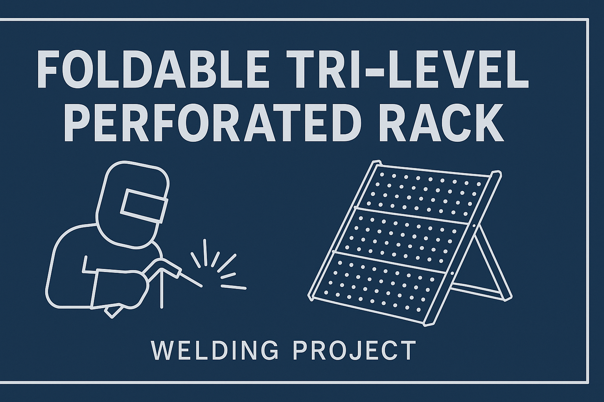
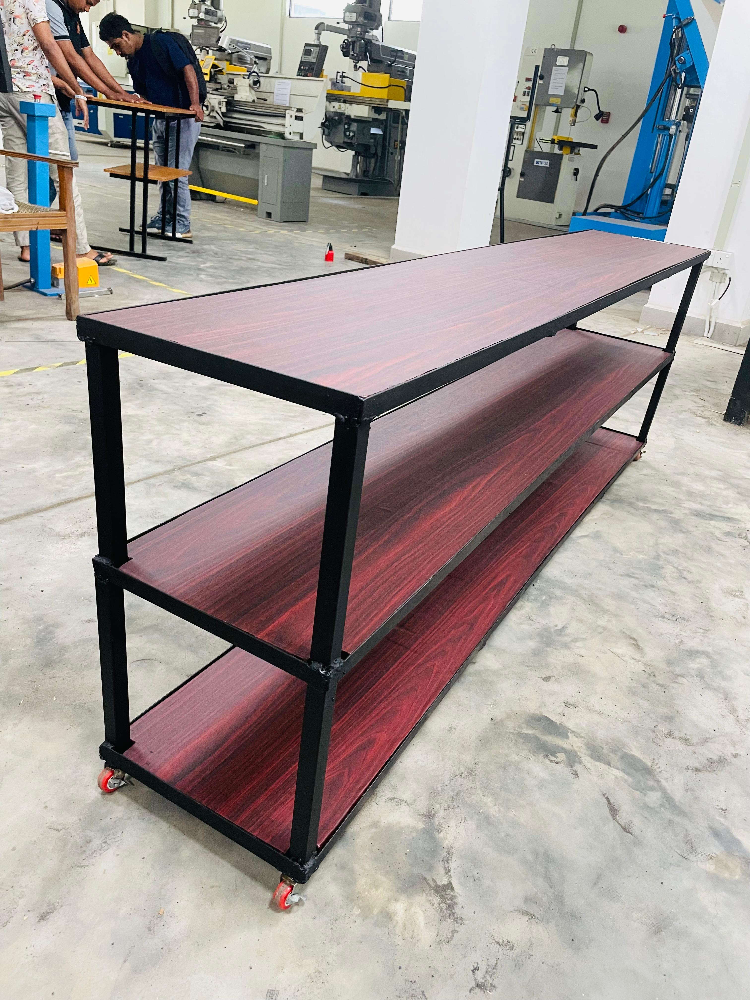
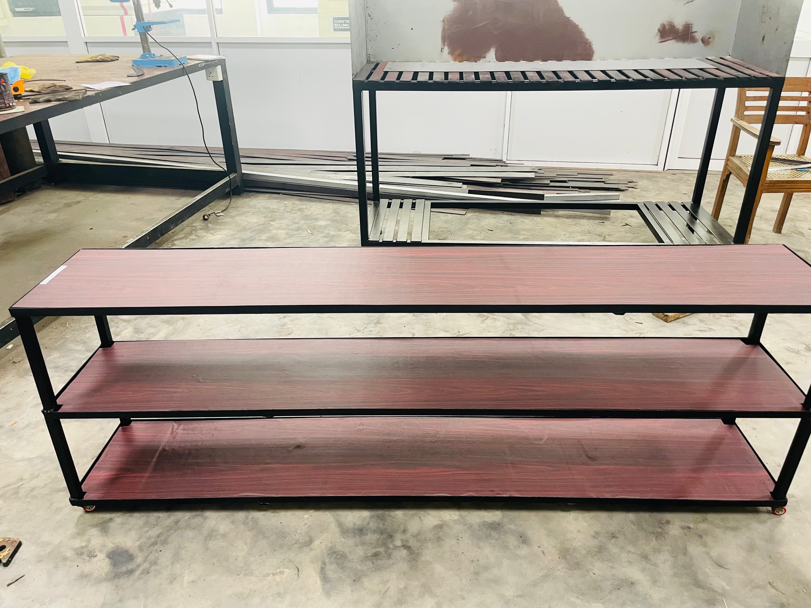
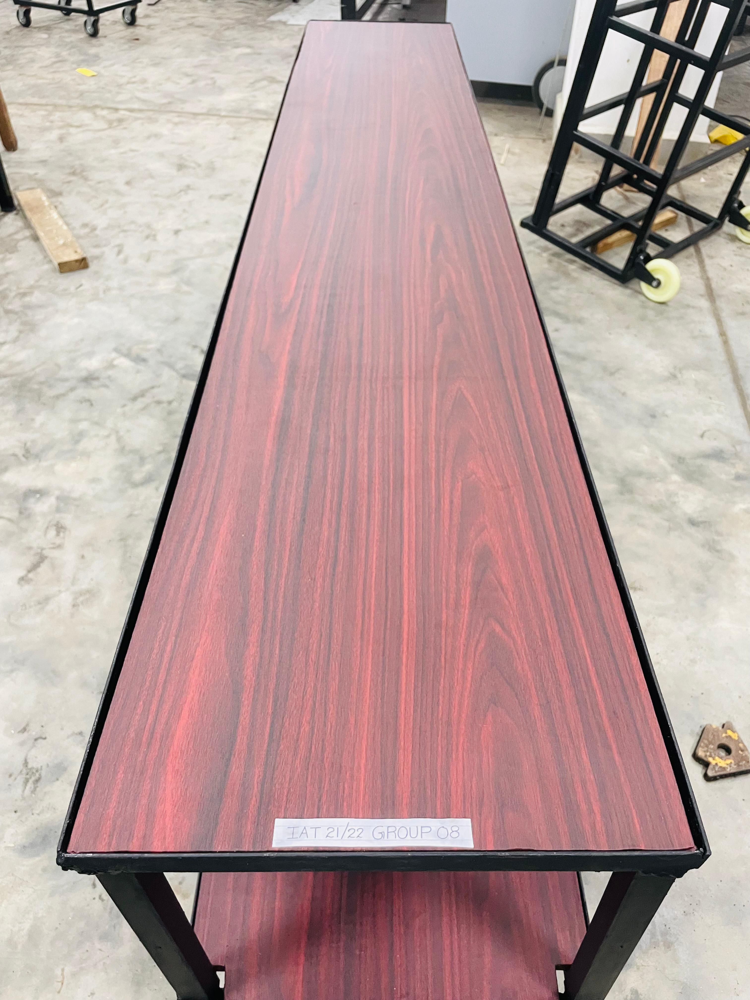
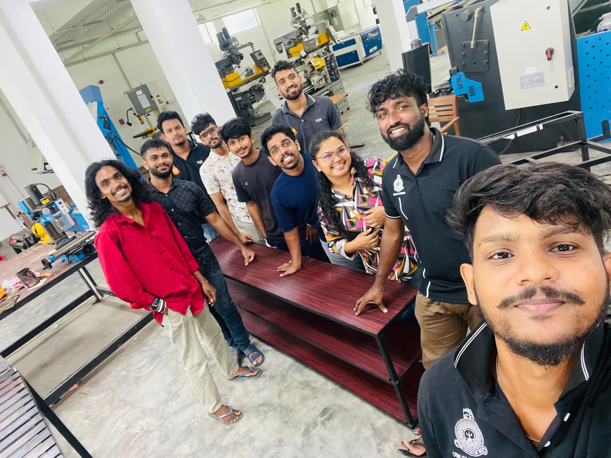
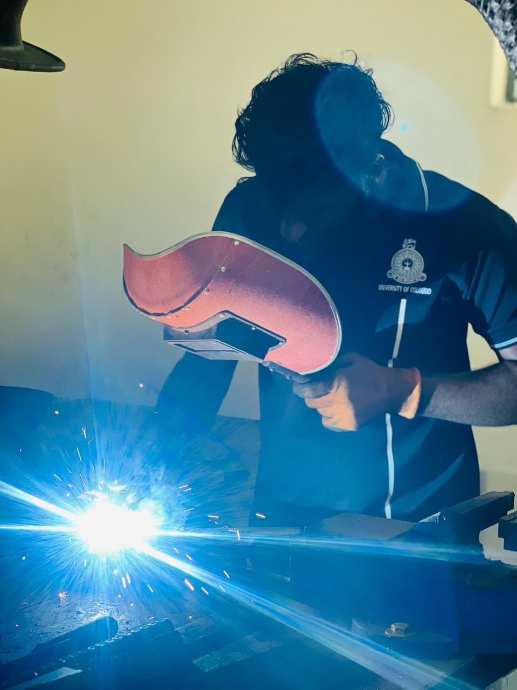
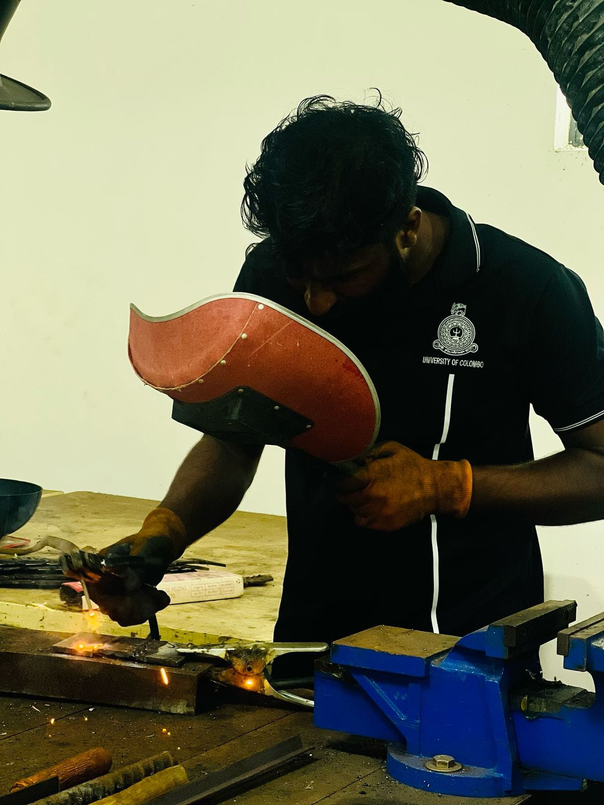
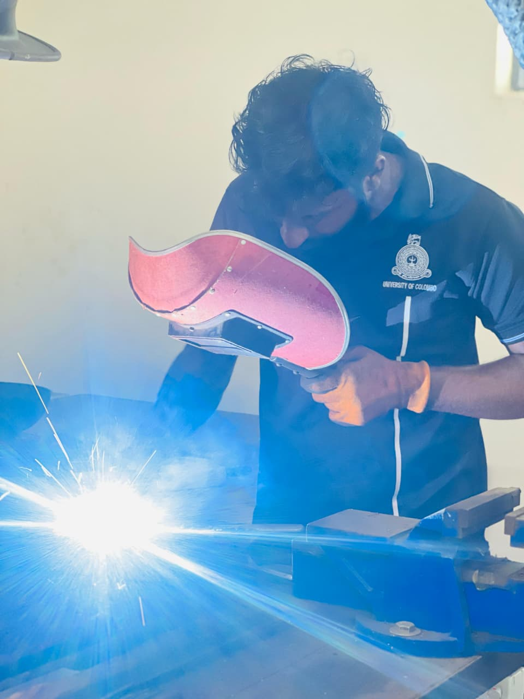

# Welding_Project
A foldable, tri-level perforated rack designed and welded for use in electronic laboratories. Provides durable, space-efficient storage for manuals, textbooks, and reference materials, keeping the lab organized and accessible.
<!-- Cover Banner -->
<p align="center">
  
</p>

# 🔧 Foldable Tri-Level Perforated Rack (Welding Project)

<p align="center">
  
</p>

## 📖 Overview
This project focuses on the design and fabrication of a **foldable tri-level perforated rack** tailored for electronic laboratories.  
The rack provides a systematic solution for organizing books, manuals, and reference materials, ensuring a neat and accessible workspace.

---

## ✨ Features
- ✅ Foldable design for portability and space saving  
- ✅ Tri-level structure for organized storage  
- ✅ Perforated metal sheets for strength and ventilation  
- ✅ Durable welding construction for long-term use  

---

## 🎯 Purpose
An essential addition to any laboratory for maintaining order and quick access to important documents and textbooks.  

---

## 🛠️ Skills Demonstrated
- Welding & fabrication techniques  
- Workshop design practices  
- Team collaboration & project management  

---

## 📷 Project Images
Here are some images from the fabrication and final rack:

<p align="center">
  
  
  
</p>

---

## 🔥 Welding Process
Snapshots of the actual welding work done during fabrication:

<p align="center">
  
  <br><em>Welding sparks flying while joining the rack frame</em>
</p>

<p align="center">
  
  <br><em>Aligning and welding the perforated sheet</em>
</p>

<p align="center">
  
  <br><em>Close-up of the welding torch in action</em>
</p>

---

## 👥 Team Members
- **Member 1** – Welding & Fabrication  
- **Member 2** – Design & Measurements  
- **Member 3** – Cutting & Assembly  
- **Member 4** – Documentation & Reporting  

---

## 📌 How to Use
1. Clone the repo:
   ```bash
   git clone https://github.com/your-username/welding-project.git
